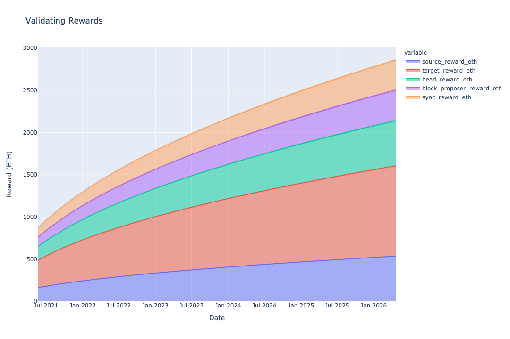
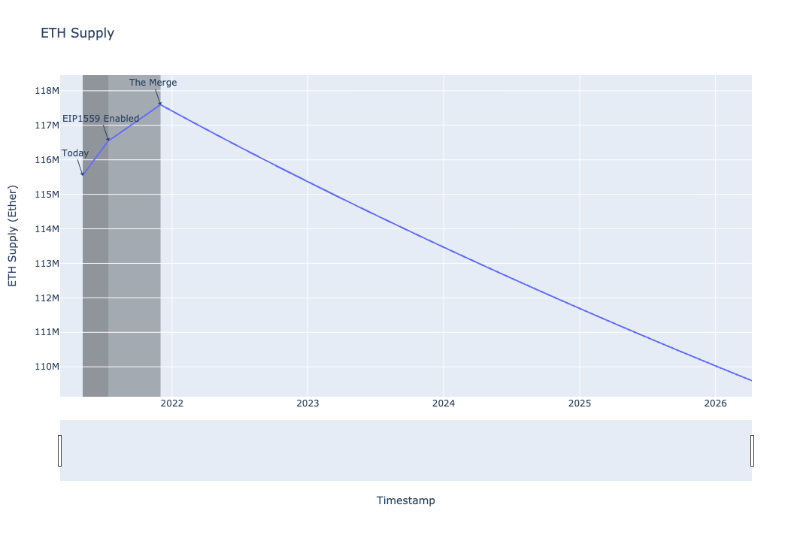
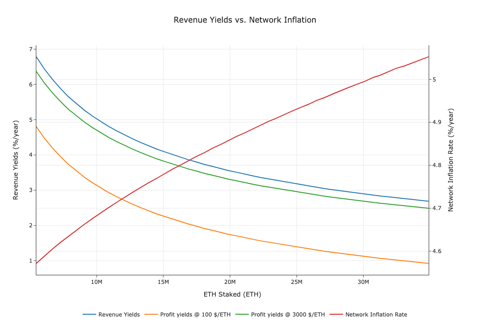
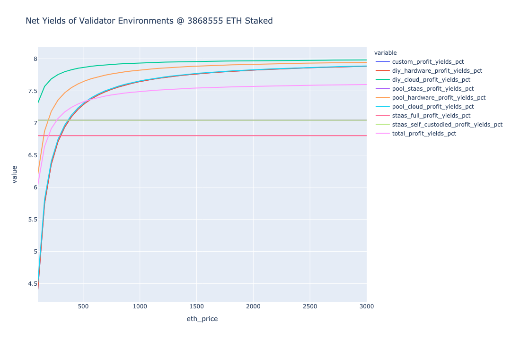
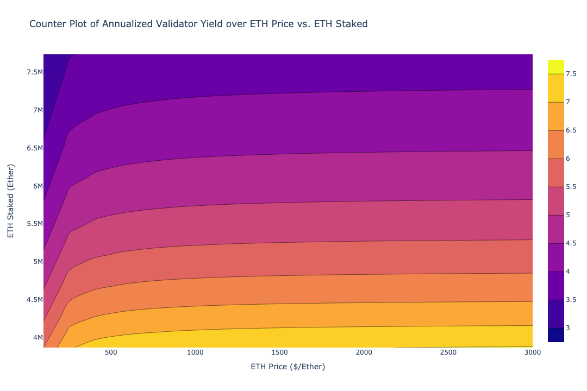
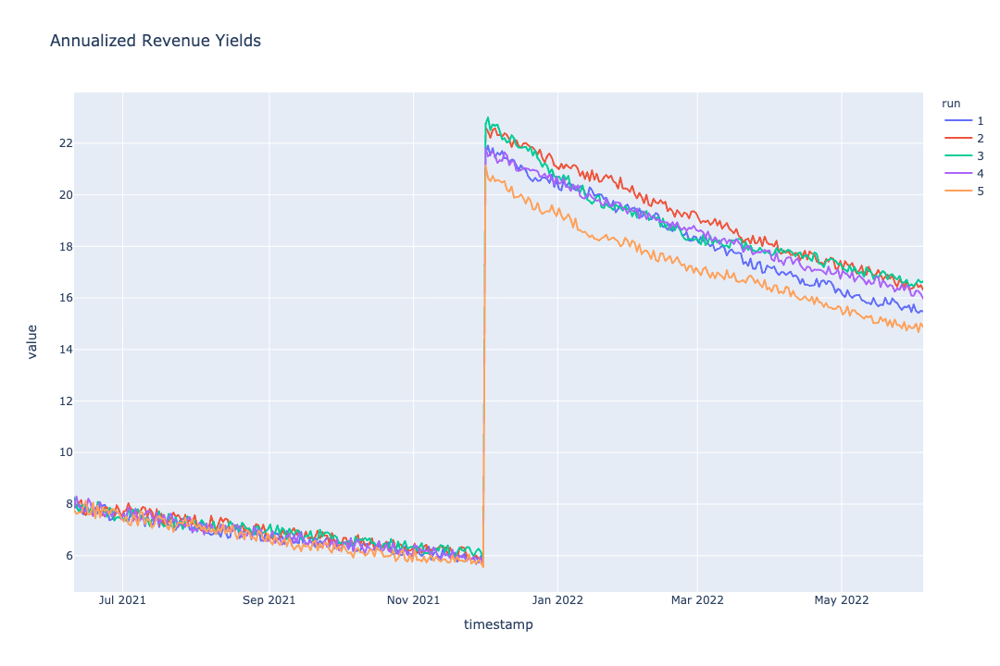

<p align="center">
  
</p>

# cadCAD Edu Eth2 Masterclass: Validator Economics Model
[](https://github.com/cadCAD-edu/eth2.0-masterclass/actions/workflows/python.yml)

An Eth2 Validator Economics model.

**Eth2 specs version**: implements the [Altair](https://github.com/ethereum/eth2.0-specs#altair) updates in the [Beige Gorgon / v1.1.0-alpha.3](https://github.com/ethereum/eth2.0-specs/releases/tag/v1.1.0-alpha.3) release.

Features:
* Simulate the different phases of the Ethereum system upgrade process (Phase 0, EIP1559 enabled, The Merge)
* Enables both State Space (simulation over time) and Phase Space (analysis of system state) simulations and analyses
* Customizable processes for ETH price, ETH staked, validator adoption, EIP1559, and transaction rates
* Modular model structure
* Referrences to [Eth2 specs](https://github.com/ethereum/eth2.0-specs) in Policy and State Update Function logic

## Table of Contents
* [Model](#model)
* [Experiments](#experiments)
* [Development](#development)
* [Tests](#tests)
* [Jupyter Lab Environment](#jupyter-lab-environment)
* [Change Log](#change-log)
* [Contributors](#contributors)

## Directory Structure
* [data/](data/): datasets used in model (e.g. for stochastic processes)
* [docs/](docs/): work-in-progress documentation of model software architecture
* [experiments/](experiments/): experiment workflow configuration and execution
* [logs/](logs/): experiment log files
* [model/](model/): model structure, parts, and configuration
* [notebooks/](notebooks/): experiment analysis notebooks
* [outputs/](outputs/): experiment outputs (images, datasets, etc.)
* [tests/](tests/): unit and integration tests for model and notebooks

---

## Model

### Parts

The model is composed of different modules in the [model/parts/](model/parts/) directory:

| Module | Description |
| --- | --- |
| [ethereum.py](model/parts/ethereum.py) | Genereal Ethereum mechanisms, such as the EIP1559 transaction pricing mechanism, and updating the ETH price and ETH supply |
| [incentives.py](model/parts/incentives.py) | Proof of Stake incentives |
| [metrics.py](model/parts/metrics.py) | Calculation of validator costs, revenue, profit, and yield metrics |
| [phases.py](model/parts/phases.py) | Management of phases of the Ethereum system upgrade process |
| [spec.py](model/parts/spec.py) | Relevant extracts from the Eth2 spec |
| [validators.py](model/parts/validators.py) | Validator processes such as validator activation, staking, uptime |

### Configuration

The model is configured using modules in the [model/](model/) directory:

| Module | Description |
| --- | --- |
| [constants.py](model/constants.py) | Constants used in the model e.g. number of epochs in a year, Gwei in 1 Ether |
| [parameters.py](model/parameters.py) | Model System Parameter definition, configuration, and defaults |
| [processes.py](model/processes.py) | Helper functions to generate stochastic environmental processes |
| [simulation_configuration.py](model/simulation_configuration.py) | Simulation configuration such as the number of timesteps and Monte Carlo runs |
| [state_update_blocks.py](model/state_update_blocks.py) | cadCAD model state update block structure, composed of Policy and State Update Functions |
| [state_variables.py](model/state_variables.py) | Model State Variable definition, configuration, and defaults |
| [types.py](model/types.py) | Various types used in the model, such as the `Phase` Enum and calculation units |
| [utils.py](model/utils.py) | Misc. utility and helper functions |

## Experiments

The [experiments/](experiments/) directory contains different experiment configurations, where each experiment has a corresponding analysis Jupyter notebook in the [notebooks/](notebooks/) directory.

### State Space
An experiment that simulates the State Space of the model (e.g. Validating Rewards over time), with phases (Phase 0, EIP1559 enabled, The Merge) representing the upgrade process of the Eth2 system.

* Experiment: [experiments/state_space/experiment.py](experiments/state_space/experiment.py)
* Notebook: [notebooks/state_space.ipynb](notebooks/state_space.ipynb)





### Revenue Yields vs Network Inflation
Analysing the revenue yields of validators and network inflation for a static ETH price over discrete ETH staked values.

* Experiment: [experiments/revenue_yields_vs_network_inflation/experiment.py](experiments/revenue_yields_vs_network_inflation/experiment.py)
* Notebook: [notebooks/revenue_yields_vs_network_inflation.ipynb](notebooks/revenue_yields_vs_network_inflation.ipynb)



### Validator Environment Yields
Analysing different validator environment yields for static ETH staked over discrete ETH price values.

* Experiment: [experiments/validator_environment_yields/experiment.py](experiments/validator_environment_yields/experiment.py)
* Notebook: [notebooks/validator_environment_yields.ipynb](notebooks/validator_environment_yields.ipynb)



### Validator Yield Surface
Generate and analyse 2D contours and 3D surfaces for validator yields vs. different system states.

* Experiment: [experiments/validator_yield_surface/experiment.py](experiments/validator_yield_surface/experiment.py)
* Notebook: [notebooks/validator_yield_surface.ipynb](notebooks/validator_yield_surface.ipynb)



### EIP1559
Analysing the effect of enabling EIP1559 under different conditions.

* Experiment: [experiments/eip1559/experiment.py](experiments/eip1559/experiment.py)
* Notebook: [notebooks/eip1559.ipynb](notebooks/eip1559.ipynb)

### Validation
Various experiments used to validate the results of our model against the Hoban/Borgers Report model as a sanity check; due to Altair update, they will not exactly match.

* Experiments: [experiments/validation/*/experiment.py](experiments/validation/)

### Monte Carlo (Work in Progress)
Applying stochastic processes to the ETH price, validator staking, and validator uptime processes, and executing 5 Monte Carlo runs.

* Experiment: [experiments/monte_carlo/experiment.py](experiments/monte_carlo/experiment.py)
* Notebook: [notebooks/monte_carlo.ipynb](notebooks/monte_carlo.ipynb)



### Justin Drake APR (Work in Progress)
Demonstrate the model's ability to compute numerical results by comparing the results of our analysis to Justin Drake's scenario analysis (optimistic, lean optimistic, best guess, lean conservative, conservative).

See https://docs.google.com/spreadsheets/d/1FslqTnECKvi7_l4x6lbyRhNtzW9f6CVEzwDf04zprfA

* Notebook: [notebooks/justin_drake_apr.ipynb](notebooks/justin_drake_apr.ipynb)

### Experiment Execution

The default experiment is an experiment that uses the default cadCAD System Parameters, Initial State, and State Update Blocks defined in the [models/](models/) directory. To run the default experiment from the terminal, execute the `experiments.run` module:
```bash
python3 -m experiments.run
```

Alternatively, open and run one of the analysis Jupyter notebooks in Jupyter Lab.

### Experiment Workflow

1. Create a new directory with the name of the experiment in the [experiments/](experiments/) directory
2. Copy the template experiment from [experiments/template.py](experiments/template.py) into the directory
3. Customize the default experiment using the template
4. Create a new Jupyter notebook using the [notebooks/template.ipynb](notebooks/template.ipynb) experiment notebook template
5. Execute your experiment, post-process and analyze the results, and create Plotly charts!

## Development

A [Makefile](Makefile) is included for convenience, for example to setup your environment and start Jupyter Lab:

```bash
python3 -m venv venv
source venv/bin/activate

make setup # Setup environment
make start # Start Jupyter Lab
```

Otherwise, follow the steps below.

### Requirements

* Python versions: tested with 3.7, 3.8
* Python dependencies: tested against versions in `requirements.txt`

### Setup

To setup a Python 3 development environment:
```bash
# Create a virtual environment using Python 3 venv module
python3 -m venv venv
# Activate virtual environment
source venv/bin/activate
# Install Python 3 dependencies inside virtual environment
pip install -r requirements.txt
```

## Tests

To run the tests using Pytest:
```bash
source venv/bin/activate
python3 -m pytest tests
```

## Jupyter Environment

### Jupyter kernel

To setup your Jupyter Kernel within your virtual environment:
```bash
source venv/bin/activate
python3 -m ipykernel install --user --name python-eth2 --display-name "Python (Eth2)"
```

### Start environment

```bash
source venv/bin/activate
jupyter notebook
# Or Jupyter Lab, following additional steps below
jupyter lab
```

### Plotly Jupyter Lab support

To install and use Plotly with Jupyter Lab, you'll need NodeJS installed to build Node dependencies. Alternatively, use Jupyter Notebook which works out the box with Plotly.

See https://plotly.com/python/getting-started/

```bash
pip install jupyterlab "ipywidgets>=7.5"
jupyter labextension install jupyterlab-plotly@4.14.3
```

## Roadmap

The following is a non-exhaustive list of possible model extensions and future features:
* Implement a dynamic EIP1559 basefee with a feedback loop based on blockspace demand / network congestion
* Backtest the model against historical data such as the ETH price, ETH staked to determine expected historical yields
* Extend the model to cover future Eth2 phases after merge, such as sharding
* ...

## Change Log

See [CHANGELOG.md](CHANGELOG.md) for notable changes and versions.

## Contributors

See [CONTRIBUTORS.md](CONTRIBUTORS.md) for contributions to this project repo.
