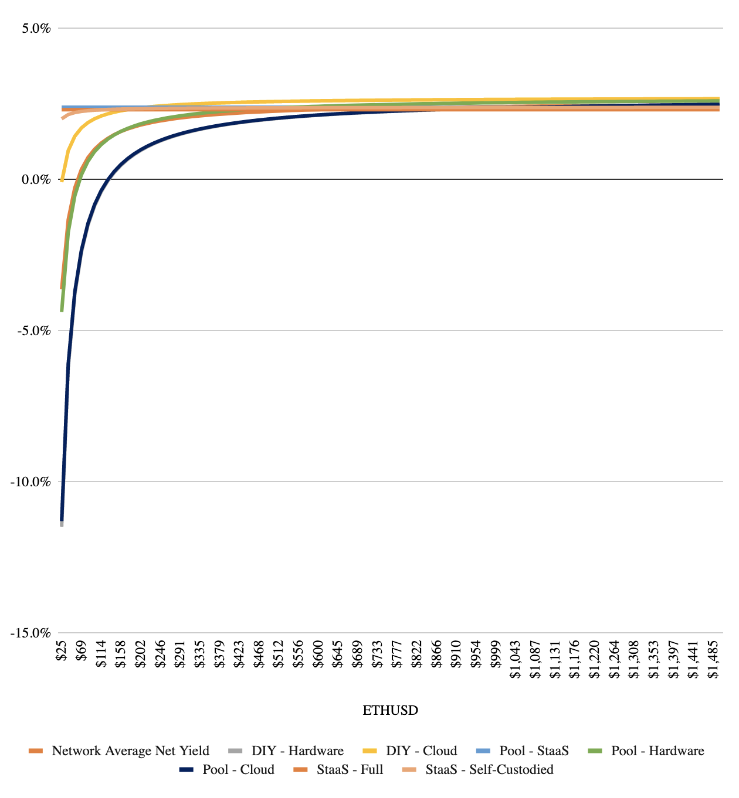
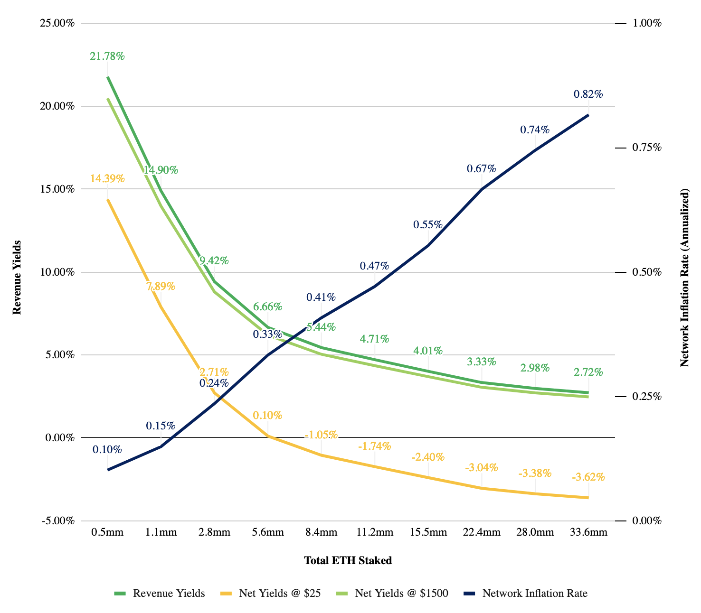
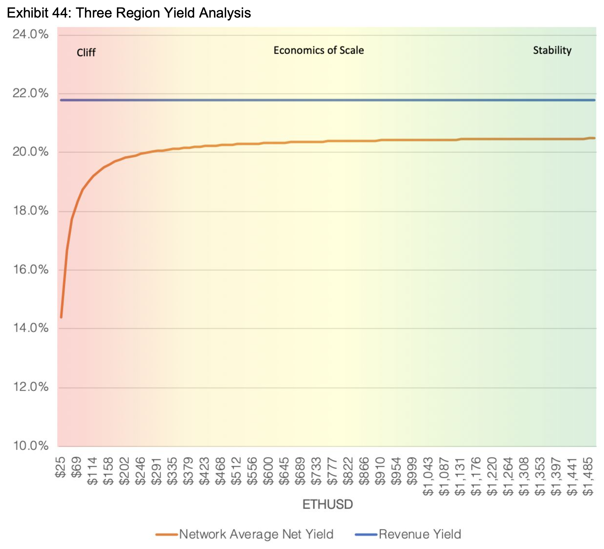
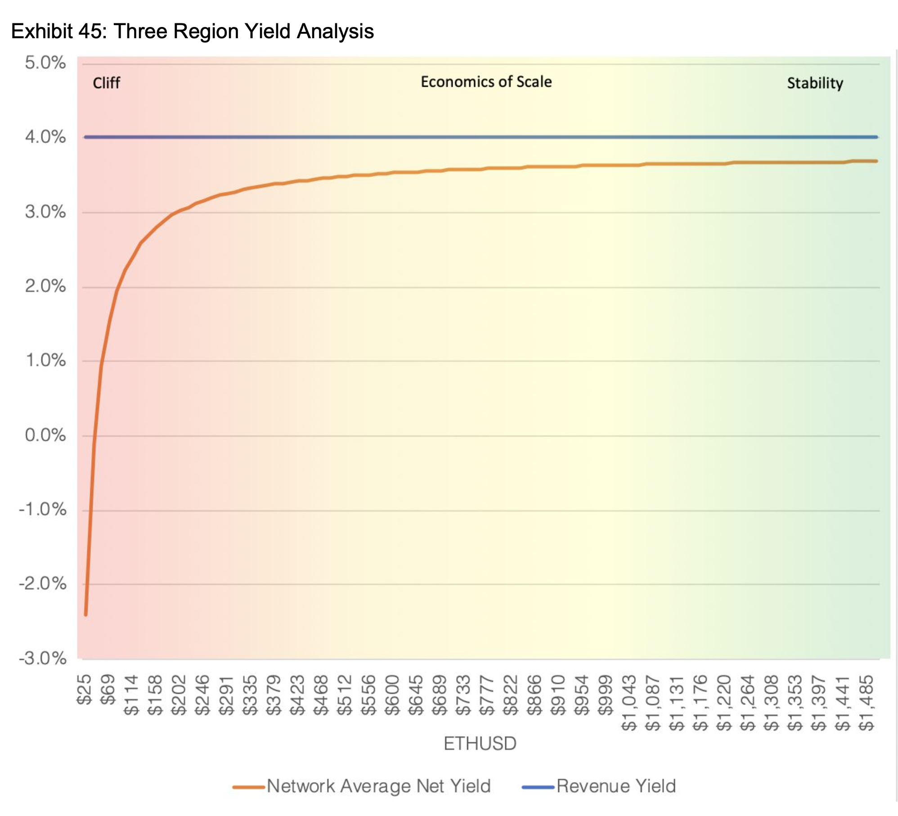

---
jupyter:
  jupytext:
    text_representation:
      extension: .md
      format_name: markdown
      format_version: '1.3'
      jupytext_version: 1.10.3
  kernelspec:
    display_name: Python (CADLabs Ethereum Model)
    language: python
    name: python-cadlabs-eth-model
---

# Experiment Notebook: Model Validation


# Table of Contents
* [Experiment Summary](#Experiment-Summary)
* [Experiment Assumptions](#Experiment-Assumptions)
* [Experiment Setup](#Experiment-Setup)
* [Analysis 1: Profit Yields Across Validator Environments](#Analysis-1:-Profit-Yields-Across-Validator-Environments)
* [Analysis 2: Network Yields and Network Inflation](#Analysis-2:-Network-Yields-and-Network-Inflation)
* [Analysis 3: Revenue/Profit Yield Spread ("Three Region Analysis")](#Analysis-3:-Revenue/Profit-Yield-Spread-("Three-Region-Analysis"))


# Experiment Summary 

The purpose of this notebook is to recreate selected scenario analyses from the (widely acknowledged) [Hoban / Borgers Ethereum 2.0 Economic Model](https://docs.google.com/spreadsheets/d/1y18MoYSBLlHZ-ueN9m0a-JpC6tYjqDtpISJ6_WdicdE) using the CADLabs model, and to compare the results. 

**Analysis 1, "Profit Yields Across Validator Environments"**, plots the average profitability of validators across different validator environments in two different adoption (i.e. total ETH staked) scenarios and a wide range of ETH prices. A description of the different validator environments and respective assumptions can be found in the [assumptions document](../../ASSUMPTIONS.md). 

**Analysis 2, "Network Yields and Network Inflation"**, combines the simulation of average (i.e. not validator environment specific) Revenue Yields, Profit Yields (across two illustrative ETH price levels), with the associated overall network inflation. 

**Analysis 3, "Revenue/Profit Yield Spread "Three Region Analysis""**, compares the spread between average (i.e. not validator environment specific) Revenue Yields and Profit Yields across a wide range of ETH prices, and across the two adoption scenarios seen earlier in this notebook.

These analyses and illustrative insights will be described in further detail in their corresponding sections.

# Experiment Assumptions

Our model adopts a range of assumptions from the Hoban/Borgers Ethereum 2.0 Economic Model (notably all validator cost assumptions across validator environments).
Since the Hoban/Borgers Model was published pre-Altair and the CADLabs model post-Altair, however, some assumptions differ slightly (notably validator incentive parameters, and rewards such as the new sync committee reward). Hence rather than a perfect match of simulation results we expect a very close match, which will serve the purpose of a sanity check.

See [assumptions document](../../ASSUMPTIONS.md) for further details.


# Experiment Setup

We begin with several experiment-notebook-level preparatory setup operations:

* Import relevant dependencies
* Import relevant experiment templates
* Create copies of experiments
* Configure and customize experiments 

Analysis-specific setup operations are handled in their respective notebook sections.

```python
import setup

import copy
import logging
import numpy as np
from radcad import Engine

import experiments.notebooks.visualizations as visualizations
from experiments.run import run
from model.types import Stage
```

```python
# Enable/disable logging
logger = logging.getLogger()
logger.disabled = True
```

```python
# Import experiment templates
from experiments.default_experiment import experiment, TIMESTEPS, DELTA_TIME
```

```python
# Create a copy of the simulation
simulation = copy.deepcopy(experiment.simulations[0])

# Override default experiment System Parameters
# using assumptions from Hoban/Borgers Economic Report
simulation.model.params.update({
    "stage": [Stage.BEACON_CHAIN],
    "daily_pow_issuance": [0],  # ETH
    # Combine the validator internet (99.9%), power (99.9%), and technical (98.2%) uptime
    # from Hoban/Borgers Report
    "validator_uptime_process": [lambda _run, _timestep: 0.999 * 0.999 * 0.982],  # Percentage (unitless)
})

# Override default experiment State Variables
# using assumptions from Hoban/Borgers Economic Report
simulation.model.initial_state.update({
    "eth_supply": 112_000_000,  # ETH
    "eth_price": 25,  # USD/ETH
    "eth_staked": 524_288,  # ETH
    "number_of_validators": 16_384,  # Unitless
})

# Set runs to number of ETH price / staked samples
simulation.runs = 50
# Run single timestep, set unit of time `dt` to multiple epochs
# (see 0_README.ipynb for further details)
simulation.timesteps = 1
simulation.model.params.update({"dt": [TIMESTEPS * DELTA_TIME]})

# Drop state history substeps to improve performance
# (see 0_README.ipynb for further details)
simulation.engine = Engine(drop_substeps=True)
```

## Analysis 1: Profit Yields Across Validator Environments


The below analysis from the [Hoban / Borgers Ethereum 2.0 Economic Model](https://docs.google.com/spreadsheets/d/1y18MoYSBLlHZ-ueN9m0a-JpC6tYjqDtpISJ6_WdicdE) simulates how the average annual validator profitability varies across validator environments (deployment type) and ETH price ranges. The first analysis simulates the original Beacon Chain minimum requirement of 524,288 ETH staked, the second analysis a much higher adoption level at 33,6m ETH staked. Insights include:
* The average annual validator profitability across all validator environments is much lower in the high-adoption scenario due to systematically lower revenue yields
* As ETH approaches very low price levels, a "profitability cliff" exists for all non-StaaS (Staking-as-a-Service) validator environments in both adoption scenarios (assumes that StaaS providers offer constant ETH returns)
* Average annual validator profitability between validator environments converge as adoption and ETH price grow, due to decreasing relevance of operational costs

In a next step, we will recreate the below analysis using the CADLabs model and compare the results.


Annualized Model - Profit Yields of Validator Environments at 524_288 ETH Staked | Annualized Model - Profit Yields of Validator Environments at 33_600_000 ETH Staked
- | - |
 |  |


### Configuration

```python
# Create a copy of the simulation
simulation_1 = copy.deepcopy(simulation)

# Create a range of 50 discrete ETH price values starting at
# 25 USD/ETH and ending at 1500 USD/ETH
# Assumption adopted from Hoban/Borgers Economic Report
eth_price_samples = np.linspace(
    start=25,
    stop=1500,
    num=50
)

parameter_overrides = {
    "eth_price_process": [
        # Sample the ETH price values using the run as the index
        lambda run, timestep: eth_price_samples[run - 1]
    ],
    "eth_staked_process": [
        # A sweep of two fixed ETH staked points
        # Assumption adopted from Hoban/Borgers Economic Report
        lambda _run, _timestep: 524_288,  # Beacon Chain genesis ETH staked requirement
        lambda _run, _timestep: 33_600_000,  # 30% of the total ETH supply
    ],
}

# Override default experiment parameters
simulation_1.model.params.update(parameter_overrides)
```

### Execution

```python
df_1, exceptions = run(simulation_1)
```

### Output Preparation

```python
df_1
```

### Analysis Results

The below plots recreate Hoban/Borgers' analysis using the same validator adoption levels (524,288 ETH to 33,6m ETH) and cost assumptions. The profit yields across validator environments and adoption levels match very closely (e.g. at the 524,288 ETH staked adoption level and assuming an ETH price of 500 USD/ETH, profit yields for a StaaS validator are shown at around 18-19%; those were profitable days. We conclude that the model is valid for this specific analysis.

```python
visualizations.plot_validator_environment_yields(df_1.copy())
```

## Analysis 2: Network Yields and Network Inflation


The below analysis from the [Hoban / Borgers Ethereum 2.0 Economic Model](https://docs.google.com/spreadsheets/d/1y18MoYSBLlHZ-ueN9m0a-JpC6tYjqDtpISJ6_WdicdE) combines the simulation of average (i.e. not validator environment-specific) Revenue Yields, Profit Yields (across two illutrative ETH price levels), with the associated overall network inflation. Illustrative insights include:
* Both Revenue Yields and Profit Yields decrease systematically as adoption grows (base reward decreases at square root of number of validators, hence yields decrease)
* Profit Yields at the 25 USD/ETH price level are lower (in fact negative as adoption grows) than at the 1500 USD/ETH price level (decreasing relevance of operational costs)
* Network issuance is expected to stay below 1% per year (and in fact turn negative after EIP1559 implementation) 

In a next step, we will recreate the below analysis using the CADLabs model and compare the results.

```python
profit_yield_at_1500_dollars = 20.48
profit_yield_at_25_dollars = 14.39
```

```python
# Difference between profit yields for each ETH price scenario
profit_yield_at_1500_dollars - profit_yield_at_25_dollars
```

Annualized Model - Rev Yields vs. Network Inflation
<span style="display:block;"></span>


### Configuration

```python
# Create a copy of the simulation
simulation_2 = copy.deepcopy(simulation)

# Create a range of 50 discrete ETH staked values starting at
# the Beacon Chain genesis requirement of 524_288 ETH staked and ending at
# 30% of the ETH supply (33_600_000 ETH staked at time of report)
# Assumption adopted from Hoban/Borgers Economic Report
eth_staked_samples = np.linspace(
    524_288,
    33_600_000,
    50
)

parameter_overrides = {
    "eth_staked_process": [
        # Sample the ETH staked values using the run as the index
        lambda run, timestep: eth_staked_samples[run - 1],
    ],
    "eth_price_process": [
        # A sweep of two fixed ETH price points
        # Assumption adopted from Hoban/Borgers Economic Report
        lambda _run, _timestep: 25,
        lambda _run, _timestep: 1500,
    ],
}

# Override default experiment parameters
simulation_2.model.params.update(parameter_overrides)
```

### Execution

```python
df_2, exceptions = run(simulation_2)
```

### Output Preparation

```python
df_2
```

### Analysis Results

The below plot recreates Hoban/Borgers' analysis. The Profit Yields in each ETH price scenario differ slightly between the Hoban/Borgers and the CADLabs model - likely due to the Altair updates - whereas the annualized inflation rates match very closely, within `0.01` of a percent. We conclude that the model is valid for this specific scenario analysis.

```python
visualizations.plot_revenue_yields_vs_network_inflation(df_2)
```

```python
# Difference between profit yields for each ETH price scenario
df_2.query('subset == 1').iloc[0]['total_profit_yields_pct'] - df_2.query('subset == 0').iloc[0]['total_profit_yields_pct']
```

```python
# Minimum and maximum annualized inflation rate
(df_2.query('subset == 0')['supply_inflation'] * 100).describe()
```

## Analysis 3: Revenue/Profit Yield Spread ("Three Region Analysis")


The below "Thee Region Analysis" from the [Hoban / Borgers Ethereum 2.0 Economic Model](https://docs.google.com/spreadsheets/d/1y18MoYSBLlHZ-ueN9m0a-JpC6tYjqDtpISJ6_WdicdE) compares the spread between average (i.e. not validator environment specific) Revenue Yields and Profit Yields across a wide range of ETH prices, and across the two adoption scenarios seen earlier in this notebook. Illustrative insights include:
* As ETH approaches very low price levels, a "profitability cliff" exists in both adoption scenarios, as operational costs squeeze validators' margins
* The Revenue/Profit Yield Spread is smaller in the high adoption scenario, as Revenue decreases, but costs remain constant in dollars

In a next step, we will recreate the below analysis using the CADLabs model and compare the results.


Annualized Model - Revenue-Profit Yield Spread at 524_288 ETH Staked | Annualized Model - Revenue-Profit Yield Spread at 33_600_000 ETH Staked
- | - |
 |  |


### Configuration

```python
# Create a copy of the simulation
simulation_3 = copy.deepcopy(simulation)

# Create a range of 50 discrete ETH price values starting at
# 25 USD/ETH and ending at 1500 USD/ETH
# Assumption adopted from Hoban/Borgers Economic Report
eth_price_samples = np.linspace(
    start=25,
    stop=1500,
    num=50
)

parameter_overrides = {
    "eth_price_process": [
        # Sample the ETH price values using the run as the index
        lambda run, _timestep: eth_price_samples[run - 1]
    ],
    "eth_staked_process": [
        # A sweep of two fixed ETH staked points
        # Assumption adopted from Hoban/Borgers Economic Report
        lambda _run, _timestep: 524_288,  # Beacon Chain genesis ETH staked requirement
        lambda _run, _timestep: 33_600_000,  # 30% of the total ETH supply
    ],
}

# Override default experiment parameters
simulation_3.model.params.update(parameter_overrides)
```

### Execution

```python
df_3, exceptions = run(simulation_3)
```

### Output Preparation

```python
df_3
```

### Analysis Results

The below plots recreate Hoban/Borgers' analysis. The Revenue-Profit Yield Spread for our model closely matches the [Hoban / Borgers Ethereum 2.0 Economic Model](https://docs.google.com/spreadsheets/d/1y18MoYSBLlHZ-ueN9m0a-JpC6tYjqDtpISJ6_WdicdE) for both scenarios. We can conclude that the model is valid for this specific scenario analysis.

```python
visualizations.plot_three_region_yield_analysis(df_3.query('subset == 0').copy())
```

```python
visualizations.plot_three_region_yield_analysis(df_3.query('subset == 1').copy())
```
